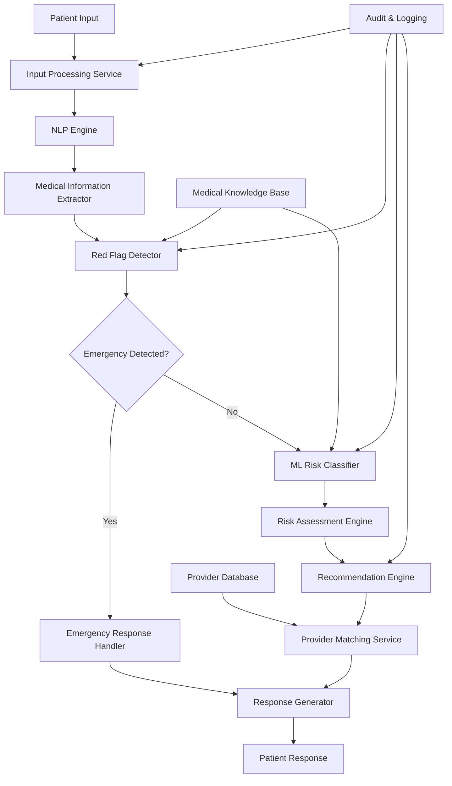
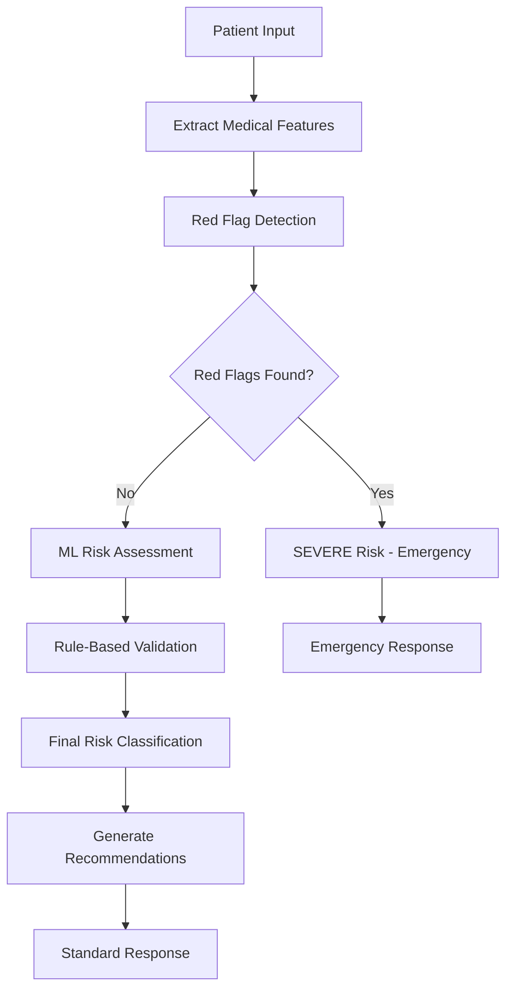

# Design Document: Healthcare Triage Chatbot

## Overview

The Healthcare Triage Chatbot is a safety-first AI system that processes natural language patient input to provide risk-stratified healthcare guidance. The system combines rule-based emergency detection with machine learning-based condition assessment to deliver appropriate care recommendations while maintaining strict safety and compliance standards.

The architecture prioritizes patient safety through a hybrid reasoning approach where emergency red-flag rules always override ML predictions, ensuring that potentially life-threatening conditions are immediately escalated regardless of AI confidence levels.

## Architecture

The system follows a microservices architecture with clear separation of concerns and fail-safe mechanisms:



## Components and Interfaces

### Input Processing Service
**Purpose**: Handles multi-modal input (text/voice) and preprocessing
**Key Functions**:
- Speech-to-text conversion for voice input
- Input sanitization and validation
- Multi-language support for Indian languages
- Session management and context tracking

**Interface**:
```typescript
interface InputProcessor {
  processTextInput(input: string, sessionId: string): ProcessedInput
  processVoiceInput(audioData: Buffer, sessionId: string): ProcessedInput
  validateInput(input: string): ValidationResult
}
```

### NLP Engine
**Purpose**: Extracts structured medical information from natural language
**Key Functions**:
- Named Entity Recognition (NER) for medical terms
- Symptom extraction with confidence scoring
- Temporal information extraction (duration, onset)
- Medical history parsing

**Interface**:
```typescript
interface NLPEngine {
  extractSymptoms(text: string): SymptomExtraction[]
  extractDuration(text: string): TemporalInfo
  extractSeverity(text: string): SeverityLevel
  extractMedicalHistory(text: string): MedicalHistory
}
```

### Red Flag Detector
**Purpose**: Safety-first emergency condition detection using medical rules
**Key Functions**:
- Rule-based pattern matching for emergency symptoms
- Symptom combination analysis for critical conditions
- Immediate escalation triggers
- Override mechanism for ML predictions

**Interface**:
```typescript
interface RedFlagDetector {
  detectEmergency(symptoms: SymptomExtraction[]): EmergencyAssessment
  checkCriticalCombinations(symptoms: SymptomExtraction[]): CriticalAlert[]
  validateRules(): RuleValidationResult
}
```

### ML Risk Classifier
**Purpose**: Machine learning-based condition assessment and risk prediction
**Key Functions**:
- Multi-class classification for medical conditions
- Risk probability estimation
- Confidence scoring for predictions
- Model interpretability features

**Interface**:
```typescript
interface MLRiskClassifier {
  classifyCondition(features: MedicalFeatures): ConditionPrediction
  calculateRiskScore(symptoms: SymptomExtraction[]): RiskScore
  explainPrediction(prediction: ConditionPrediction): Explanation
}
```

### Recommendation Engine
**Purpose**: Generates appropriate care guidance based on risk classification
**Key Functions**:
- Risk-stratified recommendation generation
- Self-care guidance for low-risk conditions
- Targeted questioning for moderate-risk cases
- Emergency escalation for high-risk situations

**Interface**:
```typescript
interface RecommendationEngine {
  generateRecommendations(riskLevel: RiskLevel, symptoms: SymptomExtraction[]): Recommendation[]
  generateQuestions(riskLevel: RiskLevel): Question[]
  generateSelfCareGuidance(condition: string): SelfCareAdvice
}
```

### Provider Matching Service
**Purpose**: Matches patients with appropriate healthcare providers
**Key Functions**:
- Location-based provider search
- Specialty matching based on condition
- Availability and affordability filtering
- Review and rating integration

**Interface**:
```typescript
interface ProviderMatcher {
  findProviders(location: Location, specialty: string, filters: ProviderFilters): Provider[]
  rankProviders(providers: Provider[], criteria: RankingCriteria): RankedProvider[]
  checkAvailability(providerId: string): AvailabilityInfo
}
```

## Data Models

### Core Data Structures

```typescript
interface SymptomExtraction {
  symptom: string
  confidence: number
  severity: SeverityLevel
  duration: TemporalInfo
  bodyPart?: string
}

interface RiskAssessment {
  riskLevel: 'LOW' | 'MODERATE' | 'SEVERE'
  confidence: number
  reasoning: string[]
  emergencyFlags: string[]
  recommendedActions: string[]
}

interface MedicalFeatures {
  symptoms: SymptomExtraction[]
  demographics: PatientDemographics
  medicalHistory: MedicalHistory
  vitalSigns?: VitalSigns
}

interface Recommendation {
  type: 'SELF_CARE' | 'SEEK_CARE' | 'EMERGENCY'
  priority: number
  description: string
  actions: string[]
  followUpAdvice: string
  providers?: Provider[]
}
```

### Emergency Red Flag Rules

The system maintains a comprehensive rule base for emergency detection:

**Cardiovascular Red Flags**:
- Crushing chest pain with radiation
- Sudden severe chest pain with shortness of breath
- Chest pain with sweating and nausea

**Neurological Red Flags**:
- Sudden severe headache ("worst headache of life")
- Sudden confusion or altered mental status
- Sudden weakness or numbness on one side

**Respiratory Red Flags**:
- Severe difficulty breathing at rest
- Blue lips or fingernails (cyanosis)
- Inability to speak in full sentences due to breathlessness

**General Red Flags**:
- Uncontrolled bleeding
- Signs of severe dehydration with altered consciousness
- High fever with stiff neck
- Severe abdominal pain with vomiting

## Risk Classification Logic

### Three-Tier Classification System

**LOW Risk**:
- Common, self-limiting conditions
- Mild symptoms with gradual onset
- No red flag indicators
- Stable vital signs (if available)

**MODERATE Risk**:
- Symptoms requiring medical evaluation
- Persistent or worsening conditions
- Unclear diagnosis requiring assessment
- Chronic condition exacerbations

**SEVERE Risk**:
- Any red flag symptom detected
- Life-threatening condition suspected
- Rapid deterioration pattern
- Critical vital sign abnormalities

### Hybrid Decision Logic



## Explainability Approach

### Multi-Level Explanation System

**Level 1 - Patient-Friendly Explanations**:
- Simple language explanations of risk assessment
- Clear reasoning for recommendations
- Visual indicators for urgency levels

**Level 2 - Clinical Explanations**:
- Detailed symptom analysis
- Rule-based reasoning chains
- ML model feature importance

**Level 3 - Technical Explanations**:
- Model confidence scores
- Feature weights and contributions
- Decision tree paths

### Explanation Generation

```typescript
interface ExplanationGenerator {
  generatePatientExplanation(assessment: RiskAssessment): PatientExplanation
  generateClinicalExplanation(assessment: RiskAssessment): ClinicalExplanation
  generateTechnicalExplanation(assessment: RiskAssessment): TechnicalExplanation
}
```

## Error Handling

### Graceful Degradation Strategy

**NLP Processing Failures**:
- Fallback to keyword-based extraction
- Request clarification from patient
- Default to higher risk classification when uncertain

**ML Model Failures**:
- Fallback to rule-based assessment only
- Maintain emergency detection capabilities
- Log failures for model improvement

**Provider Matching Failures**:
- Provide general emergency contact information
- Suggest nearest hospital for severe cases
- Offer alternative provider search methods

### Safety Mechanisms

**Input Validation**:
- Sanitize all user inputs
- Validate medical terminology
- Detect and handle edge cases

**Output Validation**:
- Verify recommendation appropriateness
- Ensure compliance with medical guidelines
- Add appropriate disclaimers

## Correctness Properties

*A property is a characteristic or behavior that should hold true across all valid executions of a system-essentially, a formal statement about what the system should do. Properties serve as the bridge between human-readable specifications and machine-verifiable correctness guarantees.*

### Property 1: Natural Language Input Processing
*For any* valid patient input (text or voice), the system should successfully process the input without errors and produce structured output containing extracted medical information.
**Validates: Requirements 1.1, 1.3**

### Property 2: Complete Medical Information Extraction
*For any* patient input containing medical information, the NLP engine should extract all present components (symptoms with confidence scores, duration when mentioned, severity when indicated, and medical history when provided) in a structured format.
**Validates: Requirements 2.1, 2.2, 2.3, 2.4**

### Property 3: Emergency Detection Priority
*For any* patient input, red flag detection should always execute before any other risk assessment methods, ensuring emergency conditions are identified first.
**Validates: Requirements 3.1**

### Property 4: Emergency Override Safety
*For any* input containing emergency red flag symptoms, the system should classify the risk as SEVERE regardless of any ML model predictions, ensuring safety-first decision making.
**Validates: Requirements 3.2**

### Property 5: Emergency Response Consistency
*For any* detected red flag condition, the system should immediately recommend urgent medical attention without exception.
**Validates: Requirements 3.4**

### Property 6: Risk Classification Completeness
*For any* processed patient input, the system should assign exactly one risk level (LOW, MODERATE, or SEVERE) with an associated confidence score.
**Validates: Requirements 4.3, 4.5**

### Property 7: Risk-Appropriate Recommendations
*For any* risk classification, the system should provide recommendations appropriate to that risk level: self-care guidance for LOW, targeted questions and specialist referrals for MODERATE, and immediate medical attention for SEVERE.
**Validates: Requirements 5.1, 5.2, 5.3**

### Property 8: Comprehensive Provider Matching
*For any* SEVERE risk case, the system should suggest healthcare providers based on location proximity, experience, affordability, availability, and reviews, with complete contact information.
**Validates: Requirements 6.1, 6.2, 6.3, 6.4**

### Property 9: Medical Safety Constraints
*For any* system output, the response should never claim to provide medical diagnosis or prescribe prescription medications, maintaining strict safety boundaries.
**Validates: Requirements 7.1, 7.2**

### Property 10: Medication Recommendation Safety
*For any* medication suggestion, the system should only recommend over-the-counter options and only for LOW risk classifications.
**Validates: Requirements 7.3**

### Property 11: Mandatory Disclaimers
*For any* system response, appropriate disclaimers about AI limitations in healthcare should be included to ensure informed patient understanding.
**Validates: Requirements 7.5**

### Property 12: Comprehensive Explainability
*For any* risk assessment or recommendation, the system should provide clear explanations including reasoning, contributing factors, and interpretable model explanations when ML influences decisions.
**Validates: Requirements 8.1, 8.2, 8.3, 8.4**

### Property 13: User-Appropriate Communication
*For any* user interaction, the system should adapt language and detail level appropriately based on user type (general public vs healthcare professionals) and context (urban vs rural).
**Validates: Requirements 9.1, 9.2, 9.3**

### Property 14: Chronic Condition Integration
*For any* patient with chronic diseases, the system should incorporate their ongoing medical conditions into the risk assessment process.
**Validates: Requirements 9.4**

### Property 15: Graceful Error Handling
*For any* system error or failure, the system should provide graceful error messages and fallback recommendations rather than system crashes or unhelpful error states.
**Validates: Requirements 10.4**

### Property 16: Low Confidence Clarification
*For any* extraction with confidence below the defined threshold, the system should ask appropriate clarifying questions to improve assessment accuracy.
**Validates: Requirements 2.5**

### Property 17: Higher Risk Prioritization
*For any* conflict between rule-based and ML risk assessments, the system should always select the higher risk classification to maintain safety.
**Validates: Requirements 4.4**

### Property 18: Multilingual Processing
*For any* input containing multiple Indian languages mixed with English, the system should process the multilingual content appropriately and extract medical information accurately.
**Validates: Requirements 1.4**

## Testing Strategy

The testing approach combines unit testing for specific functionality with property-based testing to verify universal correctness properties across all inputs.

### Unit Testing Focus
- Specific medical scenarios and edge cases
- Integration between components
- Error handling and fallback mechanisms
- Compliance with safety constraints

### Property-Based Testing Focus
- Universal properties that must hold for all patient inputs
- Safety invariants that must never be violated
- Consistency across different input formats
- Comprehensive input coverage through randomization

### Testing Configuration
- Minimum 100 iterations per property test
- Each property test references its design document property
- Tag format: **Feature: healthcare-triage-chatbot, Property {number}: {property_text}**

## Scalability and Extensibility

### Horizontal Scaling
- Microservices architecture enables independent scaling
- Stateless service design for easy replication
- Load balancing across service instances
- Database sharding for patient data

### Extensibility Points
- Pluggable ML models for different medical specialties
- Configurable rule sets for different regions
- Extensible provider database integration
- Multi-language NLP model support

### Performance Optimization
- Caching for frequently accessed medical knowledge
- Asynchronous processing for non-critical operations
- Connection pooling for database operations
- CDN integration for static medical content

### Monitoring and Observability
- Real-time performance metrics
- Medical decision audit trails
- Error rate monitoring and alerting
- Patient interaction analytics